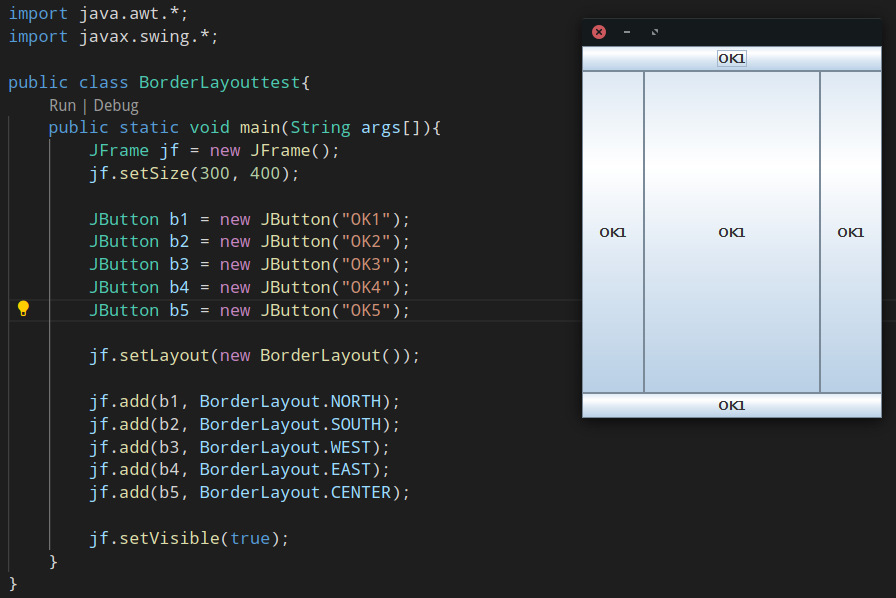
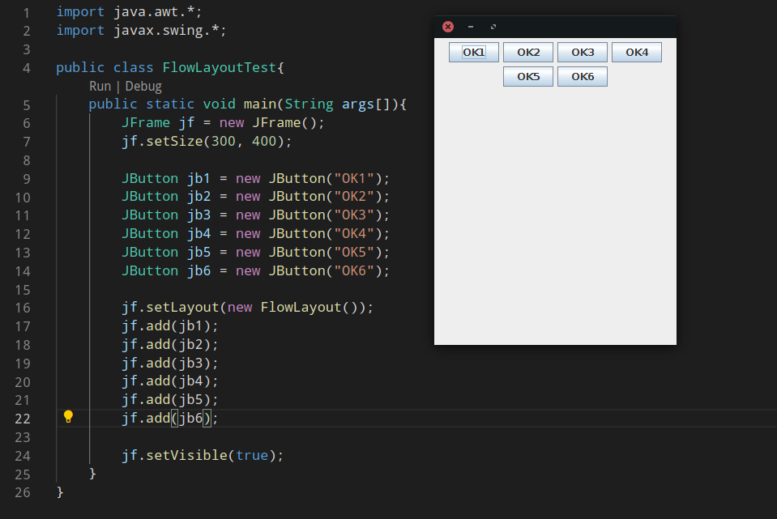
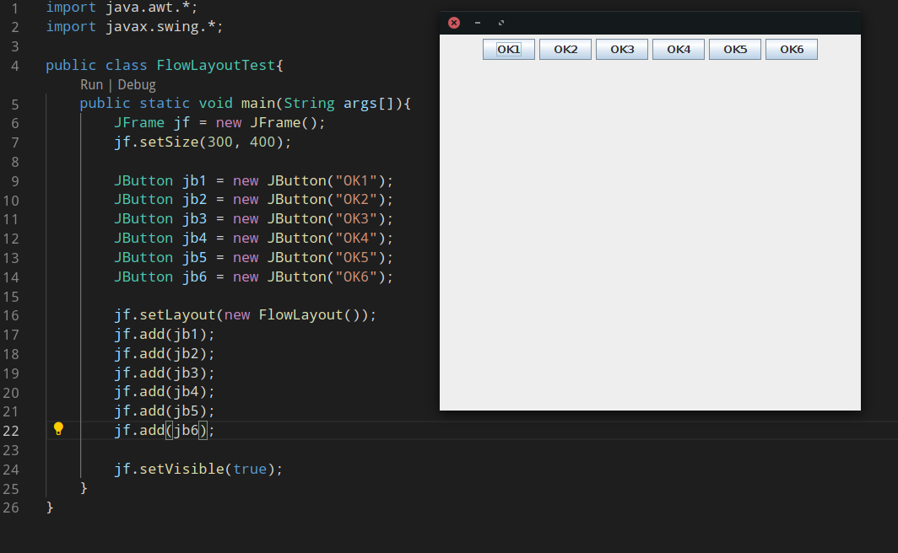
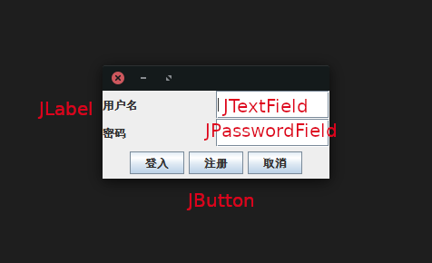
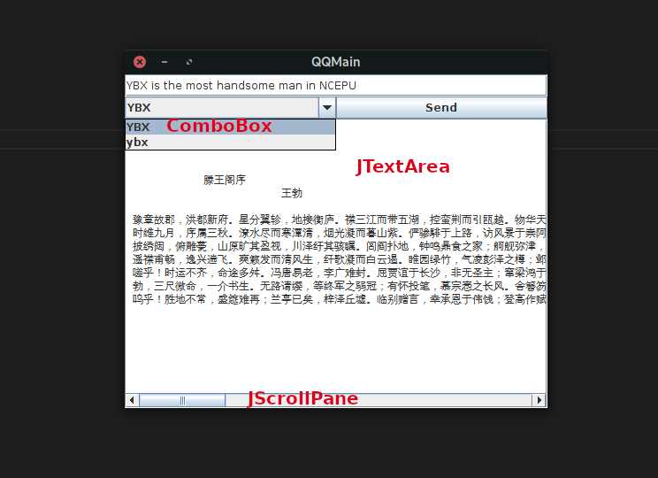

# 页面的3种布局
### BorderLayout

### GridLayout

### FlowLayout

# 常用组件
下面的所有组件最终都要放在 JFrame 上面。
### JPanel——画布
JPanel可以放在JFrame上面，也可以放在JPanel上面
### JLabel——文本提示

### JTextField——单行文本输入

### JPasswordField——密码

### JComboBox——下拉框

### JTextArea——多行文本输入

### JScrollpane——滚动条
