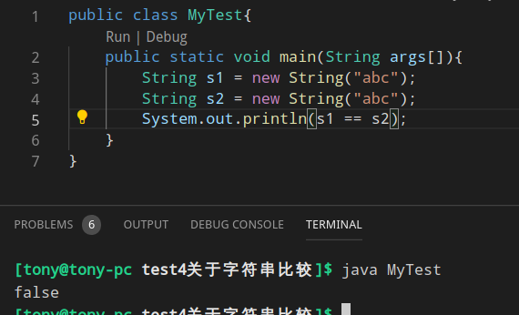
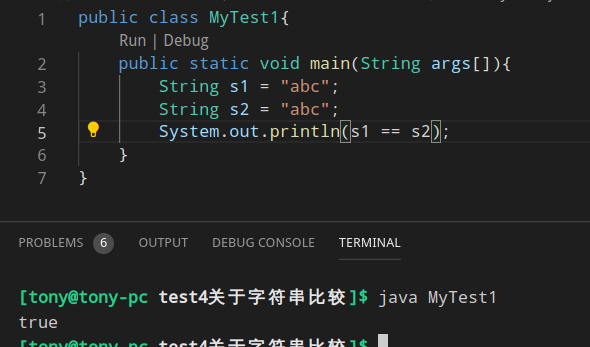
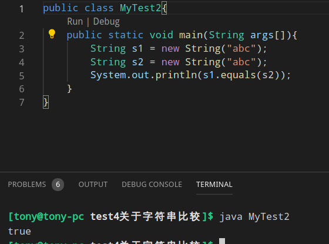

# 关于字符串比较
```java
public class MyTest{
    public static void main(String args[]){
        String s = new String("abc");
    }
}
```
其中这个 abc 就是对象


这个 s 其实就指向abc的指针，不是内容





可见 equals 是比较内容， == 是比较是否同一个值


