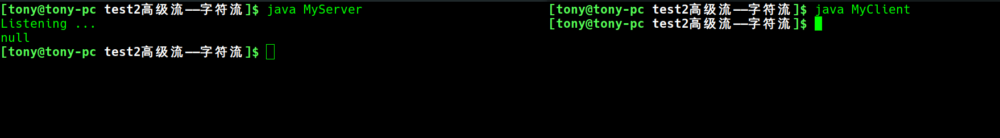

# 使用 Socket 传输高级流——字符流
介于字节流传输的缺点，我们改用字符流

在字符流里面有 ```BufferedReader``` 和 ```PrientWriter``` ,他们对应的是 ```Reader``` 和 ```Writer```(不是```FileReader``` 和 ```FileWriter```，他们是操作文件的)

但是不能看到结果



原因就是 ```PrintWriter``` 这个带有缓冲区的写操作，需要刷新或关闭，这样太麻烦，[改进方法](../test3字符流改进/MyClient.java)就是在 new PrientWriter 的时候加入第二个参数 ```true```
```java
    PrintWriter pw = new PrintWriter(osw, true);
```

### 重要提醒
如果不写 ```true```，就是自动刷新模式，经常出现很多莫名其妙的问题，但是这个编译错误找不出来，运行也没有异常