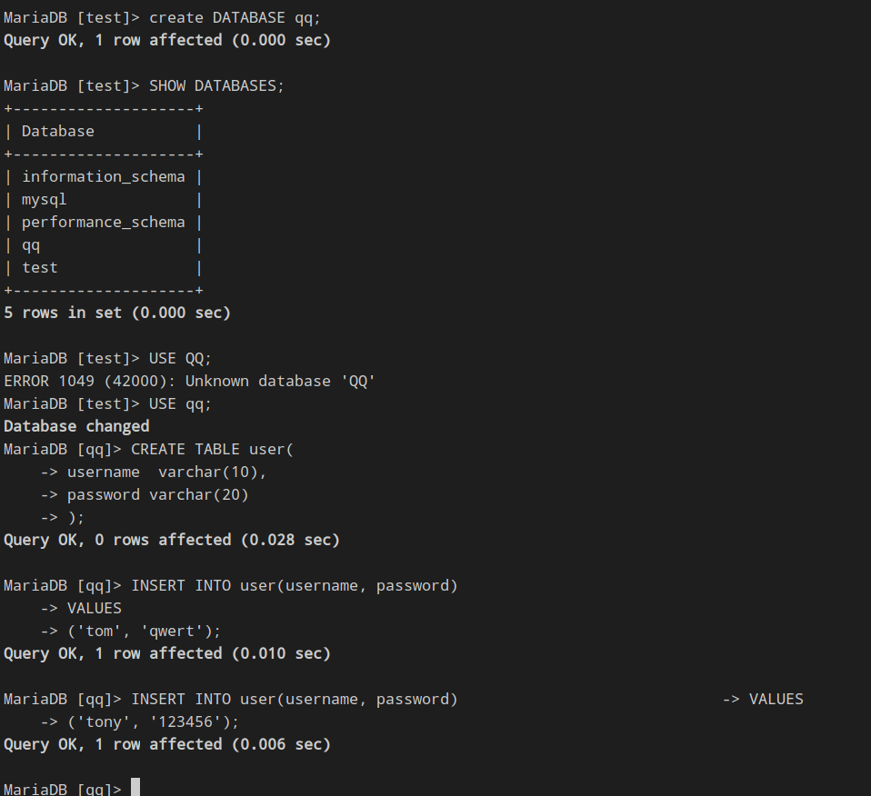
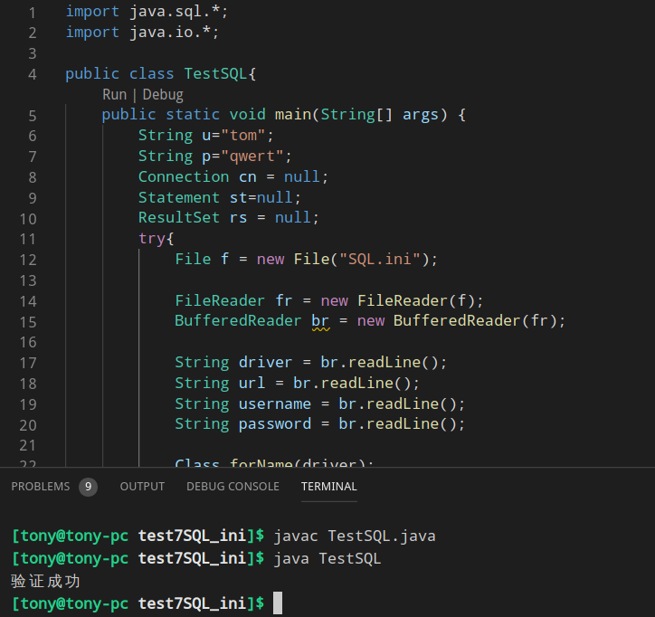

# 数据库访问

没有数据库其实也可以管理用户，[用文件模拟数据库](test1用文件模拟数据库/MyUser.java)

后来人们发现大量数据需要增、删、改、查，就将这四个常用的方法做成一个产品——数据库。

当然就4个方法就要卖钱太简单了。如果有一大堆数据需要管理，最重要的是**安全**——不能任何人都能看或者修改、数据不能丢失。

其次就是**性能**

#### 表
表是有列与行组成的，
列是固定的，行是变化的。

#### 库
在项目开发中，为了管理方便，人们将一些相关的表组织起来形成库。

# 数据库设计
数据库设计是一个高级话题，

得到数据之后，我们需要设计数据库

## 第一范式——得到纯粹二维表
下面这张表是不能直接入录数据库的，因为数据库的表必须是**纯粹的二维表**，就是线要通到底

<style>
table {
	border-collapse: collapse;
}
  
td {
	text-align: center;
	height: 50px; /*这里需要自己调整，根据自己的需求调整高度*/
	position: relative;
}
td[class=first]{
	width: 100px;
}
td[class=first]:before {
	content: "";
    position: absolute;
    width: 1px;
    height: 170px;
    top: 0;
    left: 0;
    background-color: #000;
    display: block;
    transform: rotate(-68deg);
    transform-origin: top;
    -ms-transform: rotate(-65deg);
    -ms-transform-origin: top;
}

.title1{
	position: absolute;
	top: 0px;
	right:30px;
}
.title2{
	position: absolute;
	top: 26px;
	right:95px;
}

</style>
<table>
		<tr>
			<td class="first" colspan="2"><span class="title1">学科</span><br><span class="title2">日期</span></td>
			<td>语文</td>
			<td>数学</td>
			<td>外语</td>
		</tr>
		<tr>
			<td>第1学期</td>
			<td>月考<br>期中考<br>期末考</td>
			<td> </td>
			<td> </td>
			<td> </td>
		</tr>
		<tr>
			<td>第2学期</td>
			<td>月考<br>期中考<br>期末考</td>
			<td> </td>
			<td> </td>
			<td> </td>
		</tr>
	</table>


变成纯粹的二维表就实现**第一范式**了。

## 第二范式——消除主键依赖
下面的表三个同学对应一个班主任，班主任信息重复，**”学号“** 是这个表的主键(学号可以确认学生的姓名，性别，班主任)，班主任的性别与生日与学生的学号关系不大，可以消除非住家关系。

学号|姓名|生日|性别|班主任姓名|班主任性别|班主任生日
:-:|:-:|:-:|:-:|:-:|:-:|:-:
001|张三|1990年7月12日|男|张无忌|男|1974年7月12日
002|李四|1991年8月5日|男|张无忌|男|1974年7月12日
003|王五|1990年12月8日|男|张无忌|男|1974年7月12日

得到下面两张表。学生表所有项目都依赖主键，班主任表的主键是班主任的编号，两个表的班主任编号有关系

**学生表**
学号|姓名|生日|性别|班主任编号
:-:|:-:|:-:|:-:|:-:
001|张三|1990年7月12日|男|T01
002|李四|1991年8月5日|男|T01
003|王五|1990年12月8日|男|T01

**班主任表**
班主任编号|姓名|性别|生日
:-:|:-:|:-:|:-:
T01|张无忌|男|1974年7月12日

```SQL
[MySQL]> CREATE table teacher(tid varchar(10) primary key,  
                    name varchar(10) not null,
                    sex char(2), 
                    birthday date);

[MySQL]> CREATE table student(id varchar(10) primary key,  
                    name varchar(10) not null,
                    sex char(2), 
                    birthday date,
                    tid varchar(10) references teacher.tid);
```

## 第三范式——消除函数依赖
老师的月收入是根据上课节数(**课时数**)与每节课多少钱(**课时标准(元/课)**)有关，所以有一下函数关系

$$月收入=课时数n\times{每节课多少钱}$$

编号|姓名|性别|课时标准(元/课)|课时数|月收入(元)
:-:|:-:|:-:|:-:|:-:|:-:
T01|张无忌|男|2|60|120

### 提前建立数据库

```SQL
MariaDB [test]> CREATE DATABASE qq;
MariaDB [test]> USE qq;
MariaDB [test]> CREATE TABLE user(
	-> username varchar(10);
	-> password varchar(20);
	-> );
MariaDB [test]> INSERT INTO user(username, password)
	-> VALUES
	-> ('tom', 'qwert')
	-> ('Tony', '12345');
```

### 提升灵活性
建立 [SQL.ini](test5讨论反射/test7SQL_ini/SQL.ini),这个是基于MySql的乳沟换成 Oracle 的数据库，只需要更改这一个问价就可以了。

