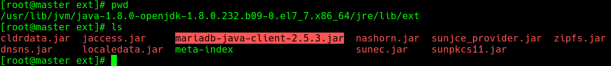
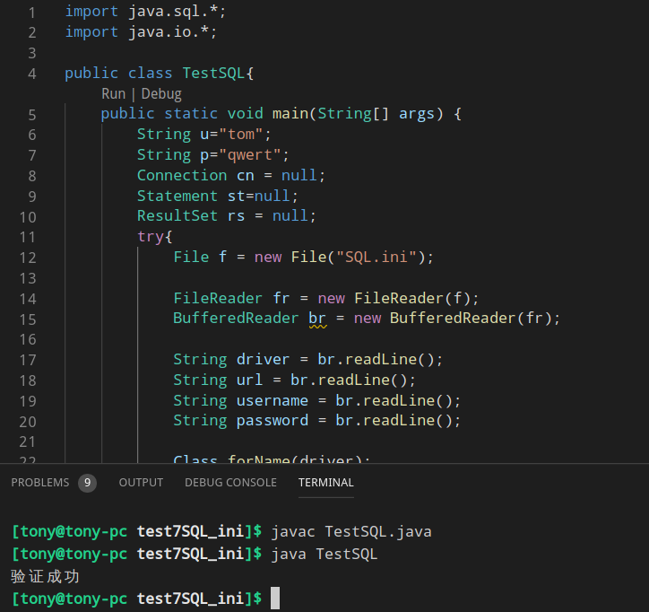
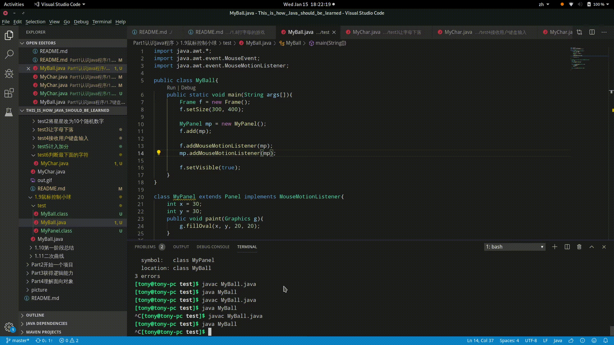

# Java就该这么学


---
#### 说明
这里使用 centos7 的openjdk，不是Oracle的JDK
```
yum search java|grep jdk
```


```
yum install java-1.8.0-openjdk

#set Java environment
export JAVA_HOME=/usr/lib/jvm/java-1.8.0-openjdk-1.8.0.222.b10-1.el7_7.x86_64
export CALSSPATH=.:$JAVA_HOME/jre/lib:$JAVA_HOME/lib:$JAVA_HOME/lib/tools.jar
export PATH=$PATH:$JAVA_HOME/bin
```


---

## 第一部分 认识Java程序
1.java纯粹的面向对象语言，程序是由一个一个类组成的

java不能直接写主函数，因为基于面向对象。

> java中类名大写
> MyTest.java

---
通俗理解函数调用：
你吃早饭，喊一声我要吃早饭，早饭就来了，你不用知道早饭是怎么做的，只要调用一下就可以了。

---

2.类名与文件名相同


源文件中有类名值 public 的话，文件名与该类同名。

3.java语言不能直接画在窗体上，必须是画布上才行，好在存在画布类
```java
Frame fr = new Frame();
Paint p = new Paint();
w.add(p);
```

4.80%思考任务，20%思考知识

5.Math.random() 产生的是0-1之间的数字

6.传数值的时候，需要考虑是否需要强制类型转换

7.不要写成——T1.6
```java
int x[] = new int[300] ;
int y[] = new int[300] ;
//类里面不要直接写语句，应该放到方法里面
for(int i = 0 ; i < 300 ; i ++){
    x[i] = (int)(Math.random()*1024) ;
    y[i] = (int)(Math.random()*768) ;
}
```    
正确关系  


所以应该写成
```java
class MyPanel{
    int x[] = new int[300] ;
    int y[] = new int[300] ;

    public MyPanel(){
        for(int i = 0 ; i < 300 ; i ++){
            x[i] = (int)(Math.random()*1024) ;
            y[i] = (int)(Math.random()*768) ;
        }
    }
}
```

8.Ctrl+Shift+Alt+R——30s
```
gsettings set org.gnome.settings-daemon.plugins.media-keys max-screencast-length 60
以秒为单位将’60’值替换为您想要的长度，例如300分钟5分钟，600分钟10分钟等等。
```

9.一般java API规律
> 得到信息是 get 开头
> eg：getKeyCode()
>
> 改变信息是 set 开头
> eg:f.setSize(300, 400);

10.[实现KeyListener接口必须实现3个方法](Part1认识Java程序/1.7键盘控制小球/test/test1/README.md)

11.将字符转换成字符串方法
> 将字符c变成对象 new Character(c)
>
> 然后调用 toString() 方法
>
> ```new Character(c[i]).toString()```

12.线程与进程的区别
线程是通过利用CPU的轮转，让程序中不同的代码段同时执行的机制。

> 进程:独立运行的程序,一个运行的记事本和浏览器是两个进程,启动两个记事本也是两个进程。
> 
> 线程:在一个进程里面能够共同运行的代码。
> 

13.接口需要实现，任何类都可以实现接口 ```implements Runnable```
```java
class MyPanel extends Panel implements Runnable{	//实现接口Runnable
	public void run(){	//计算机在合适的时间片就轮转到 run() 执行
        
    }
}

public static void main(String args[]){
	MyPanel mp = new MyPanel();

	Thread t = new Thread(mp);	//让线程 t 与 mp 关联。
	t.start();		//启动线程，调用内部的 run() 方法。
}
```

14.实现键盘监控接口
```java
import java.awt.event;
class MyPanel extneds Panel implements KeyListener{
	public void keyPressed(KeyEvent e){
        if(e.getKeyCode() == 37){
            x--;
        }
        repaint();
    }
    public void keyReleased(KeyEvent arg0){
    }
    public void keyTyped(KeyEvent arg0){
	}
}

public static void main(String args[]){
	Frame f = new Frame();
	MyPanel mp = new MyPanel();

	f.addKeyListener(mp);
	mp.addKeyListener(mp);
}
```

15.常见ASCII码
> 空格——32<br>
> 0～9——48～57<br>
> A——65<br>
> a——97


## 第二部分 开始一个项目
### 一、页面的3种布局
#### 1.BorderLayout——边框布局管理器
> NORTH——北
>
> SOUTH——南
>
> WEST——西
>
> EAST——东
>
> CENTER——中间


#### 2.GridLayout
> 事先算好行列的个数，从左到右，从上到下


#### 3.FlowLayout
> 往中间排，一排不够换下一排


### 二、常用组件
Java采用布局的方式，而不是根据坐标

下面的所有组件最终都要放在 JFrame 上面。
#### 1.JPanel——画布
JPanel可以放在JFrame上面，也可以放在JPanel上面
#### 2.JLabel——文本提示

#### 3.JTextField——单行文本输入

#### 4.JPasswordField——密码


#### 5.JComboBox——下拉框

#### 6.JTextArea——多行文本输入

#### 7.JScrollpane——滚动条


### 注册事件
参数应该是实现接口的类的对象
```java
QQLogin e = new QQLogin();
btnLogin.addActionListener(e);
btnReg.addActionListener(e);
btnCancel.addActionListener(e);
```


###### 仅事件相应分不清到底是哪一个
/error.gif)

###### 细化具体是什么相应
/out.gif)

/QQLogin.gif)

### [字符串比较](Part2开始一个项目/2.2响应用户输入/test4关于字符串比较/README.md)
想看是不是一个对象加个 . 实验一下。


> equal比较内容
>
> == 比较是否同一个

== 实例

使用 new 得到的是地址， 所以是 false


equal实例


### 哈希码——hashCode()


### [取得用户名和密码以及采用面向对象思想重写](Part2开始一个项目/2.2响应用户输入/test7取得用户名和密码以及采用面向对象思想重写/README.md)
- 构造方法一般用于**初始化**
```java
public class QQLogin extends JFrame{
	QQLogin(){
		//w.setSize(300, 400);
		this.setSize(300, 400);
	}
}
```


### 开始QQ项目
###### [实例1 QQ登入界面](Part2开始一个项目/2.1聊天界面/test5登入界面/QQLogin.java)


###### [实例2 QQ主界面](Part2开始一个项目/2.1聊天界面/test6主界面/QQMain.java)


Java分为 **客户端** 与 **服务器端** 编程，这两者被互联网隔开，只能依赖简单的消息传递让两者一起工作。所以，不一定使用同一种技术开发两端，前端使用HTML(其实是HTML， CSS， JavaScript的统称)， 后端使用Java。

早期java也负责前端有一个组件——Applet，他可以嵌入到HTML里面，但后来Flash成功以后，Applet就没落了。

###### [实例3 QQ注册事件](Part2开始一个项目/2.2响应用户输入/test3注册事件(具体)/QQLogin.java)
/out.gif)

如果 getActionCommand 的内容和声明的时候不一致就会出错
/error.gif)

### 三、面向对象
#### 1.super 与 this
super 与 this 一样都是引用
> super 是指向父类的引用
>
> this 是指向当前的引用
>

#### 2.继承注意事项
```java
A c = new B();
```
这句话之后，结果是父类的成员变量，子类的方法。


#### 3.面向对象思想来编写代码
[取得用户名和密码](Part2开始一个项目/2.2响应用户输入/test7取得用户名和密码以及采用面向对象思想重写/MyTest.java)


假定用户名是 aaa， 密码是123，登入响应


#### 4.面向对象中不应该引用另一个 class 中的成员变量，而应该是成员方法
[将聊天信息发送到服务器](Part2开始一个项目/2.4建立网络通讯/test3将聊天信息发送到服务器/test1引用变量/QQLogin.java)在 ``` test1引用变量 ```中引用变量不符合面向对象的思想
```java
//QQMain.java
	Socket s
//QQLogin.java
	QQMain w = new QQMain();
	w.s = s;		//错误用法
	w.setVisible(true);
```

正确用法
```java
//QQMain
	private Socket s;
	public void setSocket(Socket value){
		s = value;
	}

//QQLogin.java
	QQMian w = new QQMain();
	w.setSocket(s);
	w.setVisible(true);
```


### 四、I/O流
> 变量——new是对内存的操作
> 
> 语句——是对CPU的操作

语句是对CPU的操作，程序是在内存里面，操作内存比较方便，但是操作外设(键盘，硬盘，打印机，网络)就比较麻烦，程序想与他们打交道，需要用到**I/O流**

> 到内存——**入**、到内存外面——**出**

对I/O流的操作一般3步
> 1.定位<br>
> - 对于硬盘：到那个硬盘，那个目录大那个文件<br>
> - 对于网络：网络地址的那个端口
>
> 2.建立管道<br>
> 就是数据源的方向
>
> 3.操作管道<br>
> 所有离开内存的操作都是存在隐患的，需要```try{} ... catch(){}```<br>
> - 文件不存在<br>
> - 硬盘损坏<br>
> - 网络不通<br>
> - 数据库服务器没启动<br>
```java
import java.io.*;

public class MyReadFile {
	public static void main(String args[]){
		try{
			//Step1：定位数据源
			File f = new File("./test.txt");	//使用 File类 定位文件

			//Step2：建立管道
			FileInputStream fis = new FileInputStream(f);	//用 FileinputEtream类 确定方向是到内存里面。
			
			//Step3:操作管道
			int length = fis.available() ;	//操作管道，管道对象是——fis。
			for (int i = 0; i < length ; i ++ ) {
				System.out.print((char)fis.read());	//.read()方法是操作 管道fis 读一个字符。
			}
		}catch(Exception e){}
	}
}
```

如果有时间可以看看 java 家目录里面的 src.zip 里面的java代码，都是开源人写的不错的代码

> 方法——动作，变量——承担动作的对象
> 
> eg：洗(衣服)	&emsp;&emsp;&emsp;#动作需要参入参数


#### 复制大文件
首先对于 read 方法一共有3中方式重载


对于 write 方法也有3中方式重载


分析如果采用 [方式1](Part2开始一个项目/2.3IO流/test4复制大文件/test1实验1——挨个字节复制/MyReadBigFile.java) 的话需要复制21103945 次，浪费资源，时间

###### 采用 [方式2](Part2开始一个项目/2.3IO流/test4复制大文件/test2实验2——数组整块复制/MyReadBigFile.java)
缺点就是因为不是整除，所以复制的结果会更大一些，

建议数组长度采用2的n次方


###### 采用[混合方式](Part2开始一个项目/2.3IO流/test4复制大文件/test3——混合方案/MyReadBigFile.java)
先用方式2大块复制减少时间，在用方式1 处理剩余的


字节流操作```FileInputStream```、``` FileOutputStream```不能直接操作 Unicode 字符，不符合 Java “一次编写，处处运行”


为了解决这个问题，需要提出——字符流

字符流```FileReader```、```BufferedReader```、```FileWriter```、```PrintWriter```
> 需要 ```flush```、```close```

```java
// 字符流适应不同的操作系统
import java.io.*;

public class MyReadFile {
	public static void main(String args[]){
		try{
			File inFile = new File("C:/work/test.txt") ;
			File outFile = new File("c:/work/test1.txt") ;
			
			FileReader fr = new FileReader(inFile) ;
			BufferedReader br = new BufferedReader(fr) ;
			
			FileWriter fw = new FileWriter(outFile) ;
			PrintWriter pw = new PrintWriter(fw) ;
			
			while(br.ready()){
				pw.println(br.readLine()) ;
			}
			
			pw.close();	//close()会自动调用 flush() 把缓冲区的内容写入文件。
		}catch(Exception e){}
	}
}
```


### 建立网络通信
协议——我写的是汉语、你能看懂我写的是什么，汉语就是协议，大家都认同的规则。

#### 防止堵塞
##### 1.令牌环
##### 2.以太网
以太网原理：看线路上有没有信号，有就等待，没有就发送
##### 3.隔离
使用**交换机**建立**虚拟电路**，

#### 其他概念
##### 1.网关——将两个网络连在一起
网关——一台有两块网卡装有网关软件的计算机,下图当中方块就是网关。


假设左侧的子网掩码是 255.255.255.0,右侧的子网掩码是 255.255.0.0，则网关连接 159.226.43 与 226.196两个网络。

##### 2.子网掩码
子网掩码——区分**主机号**和**网络号**
> 一个IP是 159.226.43.26，如果子网掩码是 255.255.0.0，那么网络号是 159.226, 主机号是 43.26;
>
> 如果子网掩码是 255.255.255.0，那么网络号是 159.226.43,主机号是26；

##### 3.端口
对于计算机网络需要找到对应的进程——**端口**
> 80是http协议的端口、25是发送邮件的端口、1433是 SQLServer、3306是MySQL、1521是Oracle、8080是网络服务器饰演端口


#### 上传消息
服务器并不是一个强大的计算机，只是一直监听而已
```java
import java.net.*;

public class MyServer{
    public static void main(String args[]){
        try{
            ServerSocket ss = new ServerSocket(8000);

            System.out.println("Listening ....");
            Socket s = ss.accept();
            System.out.println("Listened.");
        }catch(Exception e){}
    }
}
```
客户端就是发送请求的计算机
```java
import java.net.*;

public class MyClient{
    public static void main(String args[]){
        try{
            Socket s = new Socket("localhost", 8000);
        }catch(Exception e){}
    }
}
```

#### I/O字节流
```java
//Server
import java.net.*;

public class MyServer{
    public static void main(String args[]){
        try{
            ServerSocket ss = new ServerSocket(8000);

            System.out.println("Listening ... ");
            Socket s = ss.accept();

            System.out.println(s.getInputStream().read());
            //System.out.println("Listened");
        }catch(Exception e){}
    }
}

//Client
import java.net.*;

public class MyClient{
    public static void main(String args[]){
        try{
            Socket s = new Socket("localhost", 8000);

            s.getOutputStream().write(122);
        }catch(Exception e){}
    }
}
```


字节流缺点：
- 只能发送数字
- 不能发送大于 255 的数字

#### I/O字符流
```java
//Server
import java.io.*;
import java.net.*;

public class MyServer{
    public static void main(String args[]){
        try{
            ServerSocket ss = new ServerSocket(8000);

            System.out.println("Listening ... ");
            Socket s = ss.accept();

            InputStream is = s.getInputStream();
            InputStreamReader isr = new InputStreamReader(is);
            BufferedReader br = new BufferedReader(isr);

            System.out.println(br.readLine());
        }catch(Exception e){}
    }
}

//Client
import java.net.*;
import java.io.*;

public class MyClient{
    public static void main(String args[]){
        try{
            Socket s = new Socket("localhost", 8000);

            OutputStream os = s.getOutputStream();
            OutputStreamWriter osw = new OutputStreamWriter(os);
            PrintWriter pw = new PrintWriter(osw, true);	//自动刷新

            pw.println("YBX is the most handsome man in NCEPU");
        }catch(Exception e){}
    }
}
```


#### [test3将聊天信息发送到服务器](Part2开始一个项目/2.4建立网络通讯/test3将聊天信息发送到服务器/README.md)

面向对象编程**不建议**使用变量，而是方法。

对于 ```A a = new B();```，a.变量是A 的变量，a.方法是B 的方法。

### 五、数据库操作
关于数据库访问是属于 **javaEE** 的内容，在 **javaSE** 里面找不到

#### 1.[安装MariaDB](https://mariadb.com/kb/en/mariadb-package-repository-setup-and-usage/)


[YUM安装](https://mariadb.com/kb/en/yum/#installing-mariadb-packages-with-yum)


[搭建MariaDB](https://mp.weixin.qq.com/s?__biz=MzU1OTM3ODQ0MA==&mid=2247484707&idx=7&sn=09af639b88304ece71462d935c2f0df2&chksm=fc197c44cb6ef55282101c0aa0f229d3b0c1e84ad6d89bad203039e24154b75ff1233c466e55&mpshare=1&scene=1&srcid=&sharer_sharetime=1579487429747&sharer_shareid=4df20d63d6b5f1c166ee0c94563cc50d&exportkey=AfrZv8bt7xnfcFwlIt5zsug%3D&pass_ticket=XJvN7976ULfnFfXpx9KxUlDyX9dM9L0OW0Z053MZYHY%3D#rd)


[Mariadb基本操作 ](https://mp.weixin.qq.com/s?__biz=MzU1OTM3ODQ0MA==&mid=2247486201&idx=7&sn=de1af246628be3bacbdef981fd89f89a&chksm=fc19739ecb6efa880c3e4f4121c97ddf440a8644028ce66db46608f3740fea96beb05bdb500f&mpshare=1&scene=1&srcid=01206GOmlI3ERaOwSZeiOFJC&sharer_sharetime=1579487475963&sharer_shareid=4df20d63d6b5f1c166ee0c94563cc50d&exportkey=AUxtLF5BqFTmShT%2BUJ5D4R0%3D&pass_ticket=XJvN7976ULfnFfXpx9KxUlDyX9dM9L0OW0Z053MZYHY%3D#rd)

##### 问题
访问权限


解决方案

```bash
MariaDB [(none)]> grant all privileges on QQ.* TO 'tony'@'%' identified by '12345' with GRANT OPTION;
Query OK, 0 rows affected (0.00 sec)
```

##### 使用docker

```bash
$> docker exec -it  mariadb /bin/bash
```
##### 索引
数据库本身存放数据有一个原始顺序——**原表排序**

但是这些数据可以根据不同的条件重新排序，这些排序结果放在——**索引表**

在不同的产品里面对**原表排序**和**索引表**的称呼不同

SQLServer：
- 聚集索引——**原表排序**
- 非聚集索引——**索引表**

Oracle：
- 索引组织表——**原表排序**
- 索引——**索引表**
##### 表
数据库的表就是**二维表**

表的特点是——列固定、行增加或减少。

##### 库
表太多了，为了方便管理，把相关的表组织成为**库**。

##### 数据类型
因为数据库需要分配空间，所以需要给分配的内容定义数据类型以便于分配空间。

因为数据库很专业，所以数据类型种类很多，但是不超过三类——**数字**、**字符串**、**日期**
> Mysql 支持存储文章(text)和图片(blob)，但是其他数据库可能不支持。

###### 数字
1.整数——int
> 一般大小自己用数字定义。eg:int(10)——占10位的整数

2.小数——float、double
> 大小自己用数字定义。eg:float(5, 2)——一共5位，小数点后2位小数

###### 字符串
1.char()

2.varchar()

> 区别：
> 
> char(5)存放'ab'，varchar(5)存放'ab'，在取出的时候，char的是'ab   '(ab加上3个空格)； varchar的是'ab'<br>
> **字符穿这里使用''，与C语言java语言不同**，虽然Myql支持" "，但是需要照顾其他数据库。

###### 日期——一般用于存放学生的生日
1.datetime——存放 年/月/日/时/分/秒

2.date——存放 年/月/日/

**习惯一般存放人员生日**而不是年龄，因为每年新年就要把所有人年龄加1，很麻烦。

##### 权限管理——GRANT
新建的普通用户是没有权限建立数据库的


使用root用户授权
```SQL
MariaDB [(none)]> GRANT create
    -> ON *.*
    -> TO tony@'%' 
    -> IDENTIFIED BY '12345';
```


这时在使用```create```就可以了。


##### [数据库设计](https://github.com/IammyselfYBX/Basic_skills/blob/master/%E6%95%B0%E6%8D%AE%E5%BA%93/%E6%95%B0%E6%8D%AE%E5%BA%93%E8%AE%BE%E8%AE%A1/README.md)
第一范式——得到纯粹二维表

第二范式——消除主键依赖

第三范式——消除函数依赖

#### 2.JDBC
[下载界面](https://mariadb.com/downloads/)


```
放在 $JAVA_HOME/jre/lib/ext/ 下面
```


#### 3.访问数据库
[用文件模拟数据库.java](Part2开始一个项目/2.5数据库访问/test1用文件模拟数据库/MyUser.java)

查询
```java
import java.sql.*;

public class TestSQL{
    public static void main(String[] args) {
        try{
            Class.forName("org.mariadb.jdbc.Driver");
            Connection cn = DriverManager.getConnection("jdbc:mysql://192.168.122.104:3306/test", "tony", "12345");
            Statement st = cn.createStatement();
            ResultSet rs = st.executeQuery("SELECT id, name FROM student");
            while(rs.next()){
                String id = rs.getString("id");
                String name = rs.getString("name");
                System.out.println(id+" "+name);
            }
        }catch(Exception e){}
    }
}
```

增删改
```java
import java.sql.*;

public class TestSQL{
    public static void main(String[] args) {
        try{
             //注册驱动
             String driver ="org.mariadb.jdbc.Driver";
             Class.forName(driver);
 
             //获取数据库连接
             String url="jdbc:mysql://192.168.122.104:3306/test";
             String user = "tony";
             String password = "12345";
             Connection connection = DriverManager.getConnection(url, user, password);
             System.out.println("Connection Success!!!");
             
             //Select
             System.out.println("\nThe original data:");
             Statement statement = connection.createStatement();
             ResultSet result1 = statement.executeQuery("SELECT id, name FROM student");
             while(result1.next()){
                 String id = result1.getString("id");
                 String name = result1.getString("name");
                 System.out.println("id: "+id+"\t"+"name: "+name+" ");
             }
 
             //Insert
             System.out.println("\nInsert");
             String sql1 = "INSERT INTO student VALUES(2, 'Jerry')";
             int result_insert = statement.executeUpdate(sql1);
             System.out.println("Change Line: "+result_insert);  
 
             //Select
             System.out.println("\nAfter Insert:");
             ResultSet result2 = statement.executeQuery("SELECT id, name FROM student");
             while(result2.next()){
                 String id = result2.getString("id");
                 String name = result2.getString("name");
                 System.out.println("id: "+id+"\t"+"name: "+name+" ");
             }
 
             //Update
             String sql2 = "UPDATE student SET name='tony' WHERE id=2";
             int result_update = statement.executeUpdate(sql2);
             System.out.println("Change Line: "+result_update);
 
             //Select
             System.out.println("\nAfter Update:");
             ResultSet result3 = statement.executeQuery("SELECT id, name FROM student");
             while(result3.next()){
                 String id = result3.getString("id");
                 String name = result3.getString("name");
                 System.out.println("id: "+id+"\t"+"name: "+name+" ");
             }
 
             //Delete
             String sql3 = "DELETE FROM student WHERE id=2";
             int result_delete = statement.executeUpdate(sql3);
             System.out.println("Change Line: "+result_delete);
 
             //Select
             System.out.println("\nAfter Delete:");
             ResultSet result4 = statement.executeQuery("SELECT id, name FROM student");
             while(result4.next()){
                 String id = result4.getString("id");
                 String name = result4.getString("name");
                 System.out.println("id: "+id+"\t"+"name: "+name+" ");
            }
        }catch(Exception e){
            e.printStackTrace();
        }finally{
            try{
                result1.close();
                result2.close();
                result3.close();
                result4.close();
                statement.close();
                connection.close();
            }catch(Exception e){}
        }
    }
}
```

#### 4.[反射](Part2开始一个项目/2.5数据库访问/test5讨论反射/README.md)
只有一个类被**使用**，而不是声明，其对应的静态语句块才会执行
```java
class A{
    static {
        System.out.println("aaaaaaaaaaaaaaaaaaaa");
    }
}

public class MyTest{
    public static void main(String[] args){
        A a;    //是声明不会执行
    }
}
```

Class.forName 能自动调用运行类的静态语句块，返回值是 Class，Class.forName 提供使用字符串来new对象的途径。
```java
public class Demo{
    public static void main(String args[]){
        String choice = "YBX";
        try{
            Class a = Class.forName(choice);
            Object o = a.newInstance();
            Hero h = (Hero) o;
            h.function();   //父类引用指向子类对象，执行依照 子类(YBX)方法。
        }
    }
}
```

[增加灵活性](Part2开始一个项目/2.5数据库访问/test5讨论反射/test7SQL_ini/TestSQL.java)这样以后只需要更改[SQL.ini](Part2开始一个项目/2.5数据库访问/test5讨论反射/test7SQL_ini/SQL.ini)就可以实现数据库切换，密码更改等操作。



## 第三部分 获得逻辑能力
### 一、链表
在C语言结构体**只有**数据，没有方法，但是可以使用 Java 的类来替代。
```java
//定义结构体
class Node{
    public char value = ' ';
    public Node next = NULL;
}
```
[实现链表类](Part3获得逻辑能力/3.2使用链表的记事本/test7实现backspace效果/MyLinkedNote.java)

[java系统库实现链表类](Part3获得逻辑能力/3.3让java系统库帮助你/test2链表类/MyNote.java)

### 二、面向对象与面向过程
无论编程技术发展到那一天，面向过程都是必要的基础。

面向对象进行封装，这样两个人进行合作，一个人负责写类，一个人负责写计算机内部实现逻辑，这样类内部与外部进行完美的隔离。

这样对于代码用数组实现记事本与用链表实现记事本，只需要改动一句话
```java
ArrayList al = new ArrayList();
//只需要该定义其他的都不需要变
LinkedList ll = new LinkedList();
```


### 三、泛型

### 四、Set
#### 1.[使用HashSet](Part3获得逻辑能力/3.6Set集合/test2使用HashSet/MyTest.java)

#### 2.[选择排序](Part3获得逻辑能力/3.6Set集合/test3选择排序/MyTest.java)

#### 3.[冒泡排序](Part3获得逻辑能力/3.6Set集合/test4冒泡排序/MyTest.java)

#### 4.[二分查找](Part3获得逻辑能力/3.7试试二分查找，理解二叉树/MyTest.java)
没有二分查找就没有二叉树。

#### 5.[复制一个目录的内容](Part3获得逻辑能力/3.8复制一个目录的内容/CopyDir.java)
点击按钮弹出目录对话框——```JFileChooser```


---
## 本书实例
1.[画乌龟](Part1认识Java程序/1.2画乌龟/Turtle.java)


2.[漫天星星](Part1认识Java程序/1.3满天星星/MyTest.java)


3.[飞行的小球](Part1认识Java程序/1.4飞行的小球/MyBall.java)


4.[小球撞墙](Part1认识Java程序/1.5小球撞墙/MyBall.java)


5.[下大雪](Part1认识Java程序/1.6下大雪/MySnow.java)


6.[键盘控制小球](Part1认识Java程序/1.7键盘控制小球/MyBall.java)


7.[打字游戏](Part1认识Java程序/1.8打字母的游戏/MyChar.java)


8.[鼠标控制小球](Part1认识Java程序/1.9鼠标控制小球/MyBall.java)



9.[QQ聊天软件](Part2开始一个项目/2.6应对多用户访问/QQLogin.java)

10.[记事本——数组实现](Part3获得逻辑能力/3.1用数组实现的记事本/test10Final/MyNote.java)


11.[复制一个目录的内容](Part3获得逻辑能力/3.8复制一个目录的内容/CopyDir.java)

12.[记事本升级](Part3获得逻辑能力/3.9记事本升级/MyNote.java)


